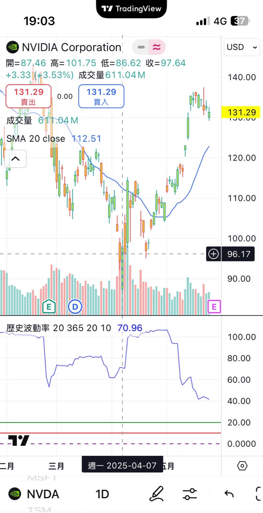

📈 VIX Alpha Strategy – Volatility-Driven Market Signal

> A simplified demonstration of a US equity trading strategy triggered by volatility (VIX) levels.  
> *This version is public-safe and intended for showcasing quantitative logic and workflow clarity.*

---

## 💡 Strategy Concept

This project implements a volatility-based entry signal for U.S. equities. The approach uses the CBOE Volatility Index (VIX) to identify potential regime shifts and market opportunities.

- 📊 **Trigger Condition:** When VIX exceeds a threshold, observe specific equities for potential entries.
- 🧠 **Decision Support:** Integrated with historical data to simulate entry/exit signals.
- 🔁 **Reusable Template:** Ready to adapt into a more complex alpha engine or pipeline system.

---

## 🧪 Demo Notebook

See [`strategy_demo.ipynb`](./strategy_demo.ipynb) for:

- Sample data processing with yfinance
- Simple VIX trigger simulation
- Chart output of signal overlay (e.g., NVDA)

*Note: This notebook is stripped of proprietary code, API keys, and real-time execution triggers.*

---

## 🖼 Example Output

  

---

## 🧰 Tech Stack

- Python (Pandas, Matplotlib, yfinance)
- Jupyter Notebook
- GitHub for version control and sharing

---

## 🔐 Disclaimer

This repo is for educational and demonstration purposes only.  
No financial advice or live trading signals are provided.  
Private logic and key parameters have been removed for safety.

---

## 📬 Contact / Collaboration

Interested in AI-driven market research or strategy prototyping?  
Let’s connect on [LinkedIn](#) or see more at [my portfolio](#).
